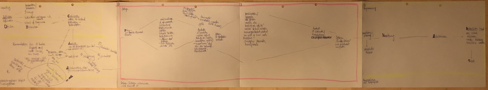

# Prozessmodell

Das für die Umsetzung meiner Webprojekte gewählte Prozessmodell ist ein Hybrid aus BADUZ, OBREDIMET und design- und webspezifischen Prozessmodellen wie Double Diamond.

Folgend ist ein Overview sichtbar und ein umfangreiches Leporello, welches dieses Modell zeigt, kann [hier](https://cloud.nadineprigann.de/index.php/s/HagAT94dbG2YaYJ) eingesehen / heruntergeladen werden.

<!-- Mittels Scrollen kann das komplette Bild angesehen werden. -> bessere Bildqualität! -->

<!-- 

 -->
