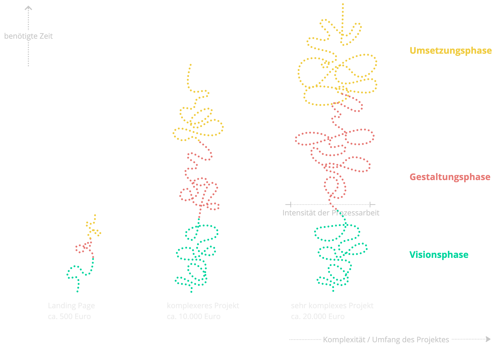

# Einführung in die Projektarbeit mit diesem Workflow

Der nachhaltigere Workflow, ein Ergebnis von Beobachtung und Analyse der typischen Workflows meiner ehemaligen Angestelltentätigkeit, und die (teilweise) neu konzipierten Prozessphasen werden in den folgenden Kapiteln vorgestellt. Lies dir gerne den folgenden Text durch, um ein umfassendes Bild davon zu bekommen, was dich auf dieser Reise zu deiner neuen Website inhaltlich erwartet.

Wenn du mehr Information möchtest, kannst du hier den [kompletten Workflow](https://trello.com/w/userworkspaceaa1c57b2e62ef5488e9680dea9d99fce) einsehen und tiefer in die einzelnen Methoden der Phasen eintauchen.

## [Vision](https://trello.com/b/DQbLT8JS/vision)

### Komponenten

Der Visionsteil hilft uns, gemeinsam herauszufinden, was du brauchst und wie das fertige digitale Produkt am Ende aussehen soll, was es können soll und wie du es verwenden möchtest. Ziel ist es, anders als bei konventionellem Webdesign und -development, eine möglichst umfassende Beobachtungs- und Analysephase anzusetzen, damit wir eure Ziele, Wünsche und auch eure Zielgruppe bestmöglich beschreiben können. Hierbei kommen v. a. Methoden und Ansätze aus der [Permakultur](https://www.permakultur.de/was-ist-permakultur), dem [Design Thinking](https://www.interaction-design.org/literature/topics/design-thinking) und dem [Dragon Dreaming](https://dragondreaming.org/) zum Einsatz. Design Thinking ist ein Prozessmodell aus dem Gestaltungsbereich, welches einem iterativen Ansatz zugrunde liegt. Dragon Dreaming ist ein Prozesstool mit indigen informiertem Ansatz, welches systemisch arbeitet und dadurch Projekte nicht linear, sondern zyklisch denkt. Weiterentwickelt wurde es von John Croft und basiert auf dem Wissen des westaustralischen indigenen Volk der Nyungar. Neben dem Zyklusdenken hat ein Dragon-Dreaming-Projekt auch immer drei unumstössliche Ziele, die jeder Intervention zugrunde liegen: den Dienst an der Erde, der Gemeinschaftsbildung (im Team, draussen) und dem individuellen Wachstum.

### Ablauf

Dieser interdisziplinäre Ansatz ermöglicht uns, die verschiedenen Qualitäten wie Beobachtung, Analyse, die Prinzipiensets, zyklisches und iteratives Denken und Gestalten mit viel Prototyping bewusst einzusetzen. Auf der Grundlage der Ethik der Permakultur und des Dragon Dreamings kreieren wir so ein spezialisiertes Produkt für dich, welches auch in der Zukunft noch gut funktioniert und können ausserdem diese Projektarbeit so gut wie möglich gestalten. Hierbei soll uns [Trello](https://trello.com/) als Tool helfen, denn es ermöglicht dir, dich jederzeit im Projektverlauf zu orientieren und mir effizientes Projektmanagement und -tracking zu gewährleisten. Weiter nutzen wir für vielfältige Aspekte unserer kollaborativen Arbeit das Whiteboard- und Prototyping-Programm [Miro](https://miro.com/).
<!-- 
Konkret werden wir in der Visionsphase viele Fragen wie bspw. das [Initial Interview](../../workflow/detailed/vision.md#initial-interview) oder die [9 Ways Of Observation](../../workflow/detailed/vision.md#9-ways-of-observation) durcharbeiten, aber auch träumerisch und maximalplanerisch mit dem [Traumkreis](../../workflow/detailed/vision.md#traumkreis) und den [Traumskizzen](../../workflow/detailed/vision.md#traumskizzen) erkunden, was denn abseits der Ratio so möglich sein kann. Hieraus werden wir dann eine starke [Vision](../../workflow/detailed/vision.md#vision) kreieren, die uns als Nordstern während unserer gemeinsamen Zusammenarbeit dient und uns immer wieder zu dem zurückführt was dir wichtig ist, sollten wir mal zu sehr im Detail gefangen sein.  -->

### Deine Ernte

Den Abschluss der Phase bildet eine Konsolidierung all dieser gesammelten Informationen in einer Art [Visionsmanifest](../../workflow/detailed/vision.md#visionsmanifest), welcher die Grundlage für das Design des Produktes bildet. Hier werden Dinge wie Skizzen, notwendige Funktionen und der Kostenrahmen, aber auch Dinge wie das Gefühl beim Benutzen und weitere sukzessive Arbeiten für die Zukunft festgehalten. Dieser steht dir zur freien Verfügung.

<!-- Generell sind die verschiedenen Karten chronologisch angeordnet, d. h., kommen auch ungefähr nacheinander zum Einsatz. Allerdings kann es auch einige Methoden und Interventionen im Backlog geben, die wir vielleicht nie oder erst später / früher brauchen. Das kommt ganz auf deinen / euren Prozess an. Betrachte(t) sie einfach als eine Art Werkzeugkoffer mit Handlungsempfehlung, aus dem wir bei Bedarf das herausnehmen, was uns weiterhilft. Du/ihr bist/seid herzlich dazu eingeladen, hier auch weitere Methoden vorzuschlagen oder anzupassen, wenn dir / euch das hilfreich erscheint. -->

### Zeitliche Planung dieser Phase

Für die Visionsphase kannst du etwa 1 bis 6 Termine im Monat einplanen. Dadurch kann diese Phase durchaus von ca. 2–3 Monaten bis hin zu einem halben Jahr dauern. Erfahrungsgemäss ist das sehr hilfreich, denn dadurch reifen Wünsche, Bedürfnisse und Konzepte eher und wir umgehen die Umsetzung einer fixen Momentidee, die sich vielleicht im Nachgang als nicht optimal herausstellt. Ein einzelner Termin dauert pro Session ca. 2 Stunden und kann per Telefon, online via [Senfcall](https://www.senfcall.de/) oder Jitsi Meet [https://meet.jit.si/?rCounter=1] oder live stattfinden.

## [Gestaltung](https://trello.com/b/eBY2NCgr)

In diesem Teil des Projektes wenden wir uns der Gestaltung der Website zu. Er besteht aus Methoden aus dem Design Thinking und dem Dragon Dreaming und wirkt als kokreative und iterative Phase, d.h. mit eng gesteckten wiederholenden Feedbackschleifen. Diese ermöglichen uns schnelle Anpassungen oder Entwicklung von Lösungsansätzen. Hierzu nutzen wir verschiedene Formen von Prototypen, um effizient eine Frage oder ein Problem entweder mit dir oder mit weiteren externen Personen zu bearbeiten, Feedback einzuholen oder Ideen zu generieren.

Durch diesen systemischen Ansatz für komplexe Systeme können wir zusammen eine resiliente Gestaltung für ein komplexes und modulares System wie eine Webseite entwickeln.

### Deine Ernte

In dieser Phase lernst du daher kreativere und zirkulärere Prozessmodelle kennen und wirst zur:m Partner:in im Gestaltungsprozess, anstatt zuarbeitende:r Kund:in. Zudem lernst du die Kraft von Prototypen und verschiedene kollaborative Tools kennen, die du in deine Praxis mitnehmen kannst.

Diese Phase schliesst mit einem Design-Dokument ab, welches dir offen zur Verfügung steht.

##  Umsetzung

### [Backend](https://trello.com/b/ygakLN72)

In der Umsetzungsphase leite ich aus dem Designdokument eine Datenstruktur für das Back End ab, die sicherstellt, dass es von dir intuitiv und einfach abgefüllt werden kann. Im weiteren Verlauf teste ich diesen Entwurf immer wieder mit dir und nehme ggf. Anpassungen vor, um ein stimmiges Back End aufzusetzen. Hier arbeiten wir wieder, wie auch in den anderen Phasen, in iterativen Feedbackschleifen, denn ich möchte ein Projekt umsetzen, dass dir bestmöglich hilft, deine Arbeit zu machen. Deshalb muss es zu dir und deinen Fähigkeiten und Bedürfnissen passen. Haben wir das Back End fertiggestellt, kannst du damit beginnen, es mit den finalen Daten zu befüllen.

<!-- werden wir uns als erstes auf einen nachhaltigen Hoster festlegen. Hier unterstütze ich dich bei der Auswahl und der Bestellung oder des Umzugs deiner Domain, der Einrichtung eines Mailaccounts für deine Domain etc. Im nächsten Schritt nehme ich auf Grundlage des Designdokumentes eine https://trello.com/c/iQ7PBJFa/8-strukturelle-analyse  vor, d. h. ich leite ab, welche Datenfelder das Back End braucht, damit es von dir intuitiv und einfach abgefüllt werden kann. Dies passiert in enger Anlehnung an das Design, damit bestmöglich abstrakte Datenbankmasken verhindert werden können und dir klar ist, woran du grade arbeitest.  -->

### [Frontend](https://trello.com/b/IPhgggyv)

Ich widme mich dann dem Front End der Seite. Hier geht es darum, die Daten des Back Ends so wie in unserem Design vorgegeben aufzubereiten und zu präsentieren.

 <!-- Wie auch im Design sind hier echte Beispieldaten von dir wie Texte, Bilder, ggf. Videos, dein Logo, etc. sehr wichtig, um mit echten Daten zu gestalten und zu entwickeln., da Blindtext wie lorem ipsum anders umbricht als unsere Sprache und dadurch das Layout verändern kann. Ausserdem wird für dich einfacher, einen Bezug herzustellen. -->

Es ist in dieser Phase sehr wahrscheinlich, dass Fälle auftreten, die wir noch nicht besprochen oder gestaltet haben, sog. edge cases, bspw. wenn das Dropdown offen ist und ich die Seite verkleinere, überlappt es die Navigation. Weiter können sich plug-ins oder Umsetzungspraktiken verändern und ich muss Alternativen suchen. Dies passiert in enger Zusammenarbeit mit dir in unseren Feedbacksessions, die du bereits kennst. Sie helfen uns dabei, schnell verschiedene Lösungsansätze zu entwickeln und geben dir zusätzlich die Möglichkeit, dich innerhalb des Projektverlaufes zu orientieren. Wie im ganzen Projekt bist du auch hier kein:e Kund:in, sondern Partner:in.

Weiter werden in dieser Phase auch Optimierungen vorgenommen, bspw. Ladezeiten optimiert und ungenutzter Code bereinigt.

Nach ausführlichem Testen und Bugfixing launchen wir die Seite final. Ich bin ab diesem Zeitpunkt noch 2 Wochen auf Rufbereitschaft, falls noch Probleme auftreten sollten.

<!-- Ist die Seite zu ca. 80% umgesetzt, werde ich sie für eine <https://trello.com/c/MGv45kI7/11-interim-evaluation> auf einer Subdomain  (<www.dev.deinedomain.com>) live schalten (deployen), um etwaige bugs, edge cases und Browserinkompatibilitäten direkt feststellen und beheben zu können. In dieser Schlussphase wird sich unsere Zusammenarbeit noch einmal intensivieren, denn je mehr Augenpaare die Seite auf Designabweichungen untersuchen, desto besser. Wenn wir mit dem Ergebnis zufrieden sind, wird sie final live geschaltet, dieses Mal auf <www.deinedomain.com>. Ich bin ab diesem Zeitpunkt noch 2 Wochen sozusagen auf Rufbereitschaft für ein <https://trello.com/c/40R6fXiz/14-bugfixing>, falls noch Probleme auftreten sollten. -->

### Deine Ernte

Nach dieser Phase steht dir das [GitHub](https://github.com/) repository, der Ort, an dem der Code zur Seite u. a. gespeichert ist, deines Projektes zur freien Verfügung. Es ist open source-lizenziert, was bedeutet, dass jede:r den Code weiterverwenden und verändern darf. Dies ist zentraler Bestandteil eines nachhaltigen und gerecht teilenden Internets (ähnlich der Permakulturethik “fair share”), denn auch ich profitiere beim Erstellen von den Erfahrungen anderer. Weiter gehört dir natürlich deine Domain und die Rechte daran. Am Ende unserer gemeinsamen Reise angekommen, hast du ausserdem einen Einblick in die Entwicklungsprozesse bekommen sowie ein Grundverständnis der Abläufe und des Codes erlangt, was dich weniger hilflos vor diesem grossen digitalen Projekt fühlen lassen kann.

##  [Evaluation](https://trello.com/b/Ya21BO5A)

In dieser letzten Phase nutzen wir einige Methoden, um das komplette Projekt zusammen zu evaluieren. Die Ergebnisse der einzelnen Retrospektiven werdne hier mit aufgenommen. Mir ist hier offenes Feedback besonders wichtig, damit ich diesen Workflow zusammen mit dir immer weiter verbessern kann. Zu dieser Phase gehört auch ein ausführliches Feiern unserer Zusammenarbeirt und dem,w as wir zusammen geschafft haben: eine individuelle und nachhaltige Webseite für dich erstellt!

## Zeitliche Gesamtplanung des Projektes

Zeitlich kannst du für den gesamten Prozess ca. 4 Monate bis zu einem Jahr einplanen, je nach Umfang und zeitlichen Verfügbarkeiten.  Generell lässt sich sagen, dass dein Anteil mit fortschreitendem Projektverlauf abnimmt. Der Arbeitsaufwand für dich ist in der Visionsphase noch relativ hoch, denn hier arbeiten wir eng zusammen und dein Input ist massgebend für die Tiefe und Qualität dieser Phase. Rechne hier grob mit ca. 2h Vor- und Nacharbeitung pro Session. Für die Designphase wird dies dann schon etwas weniger. Die Zusammenarbeit wird mehr und mehr durch Feedbacktreffen zu Entwürfen, Hindernissen etc. bestimmt. Etwa 2 Stunden pro Woche solltest du für diese Treffen einplanen. Eine Ausnahme ist der Design Sprint, den wir punktuell einsetzen. Dieser umfasst 5 Tage und sollte eng getaktet sein. In der Umsetzungsphase übersetze ich Vision und Gestaltung in Code. Da wir an diesem Punkt sehr viel Vorarbeit geleistet haben, beschränk sich dein Aufwand auf Feedbacktreffen. Ähnlich wie in der Designphase sind das etwa 2 Stunden pro Woche.

## Gesamtkosten des Projektes

Generell werden die Phasen auf Stundenbasis mit monatlicher Rechnung abgerechnet. Wir können auch, vor allem wenn die Phase kürzer ist, eine Abschlagszahlung nach Beendigung der Phase vereinbaren. Die folgende Grafik zeigt das [Kostendiagramm](https://miro.com/app/board/uXjVL_R46IQ=/?share_link_id=562033574911), welches dir verstehen helfen soll, wie sich die Preisstruktur gestaltet. Es soll dich ausserdem dazu ermächtigen, dein Projekt auf diesen Skalen in etwa einzuordnen, um dir einen ersten Überblick über die Investition zu verschaffen. Vorab schon einmal: mir ist bewusst, dass das für dich eine grosse Investition sein kann. Da ich möglichst vielen Menschen / Initiativen den Zugang zu einer professionellen, nachhaltig und gut geplanten und umgesetzten Website ermöglichen möchte, bin ich offen für einige Zahlungsabsprachen: Tausch, Ratenzahlung, Abschlagszahlung, mtl. Zahlungseinheiten, etc. sind möglich. Lass uns gerne darüber sprechen.

Möchtest du noch mehr Informationen sowie die Entstehungsgeschichte lesen, schau dir gerne die [Dokumentation des Projektes](../documentation) an.

Solltest du Fragen haben, melde dich sehr gerne mit deinem Anliegen. Ich freue mich auf die Zusammenarbeit mit dir und deinem Projekt!

<!-- Solltest du Anmerkungen, Kritik oder Ideen haben, die du teilen möchtest, melde dich bitte gerne unter [dev@nadineprigann.de](mail.to:dev@nadineprigann.de). Ich freue mich immer auf Austausch und Kollaboration, denn dadurch kann ein resilienteres Projekt entstehen. -->

<!-- Für mich gingen mit dem Design des Workflows auch die Fragen der Repräsentation einher: wo wird dieser Workflow festgehalten? Wie wird er visuell dargestellt? Welche Aufgaben hat diese Visualisierung? Kann ich die reine Visualisierung mit einem Mehrwert verknüpfen? -->
